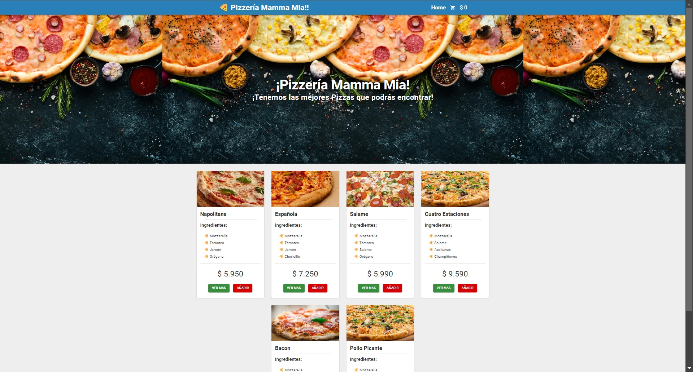

# Módulo 4.1 React II Trabajo Práctico (Desafío)

## Presentación de Página Web

 

---

 

## Descripción del PY ⌨️

En este desafío utilicé React Router para controlar rutas y redireccionamientos y el
Context API para almacenar y modificar el estado global.
La pizzería italiana Mamma Mia! SPA me solicita realizar su aplicación web para mostrar y
vender sus pizzas. Esta app mostrará los distintos tipos de pizzas y sus ingredientes a
través de una archivo JSON que tiene un arreglo de objetos correspondientes a cada tipo de pizza con su nombre,
ingredientes, imagen, descripción, ID y precio. La aplicación incluye un carrito y una vista de detalle por
cada pizza seleccionada en el catálogo ubicado en la vista principal.

## Tecnologías Usadas 🛠️

- **HTML** 💀
- **CSS** 🌈
- **JS** 🧑‍💻
- **React** 🎆
- **React Router** ⌨️
- **Material UI** 📚
   

---

 

## Autor 👨‍💻

**Luis Fernando Sanchez F. ⚡**

Sígueme en mis redes sociales: 
 
